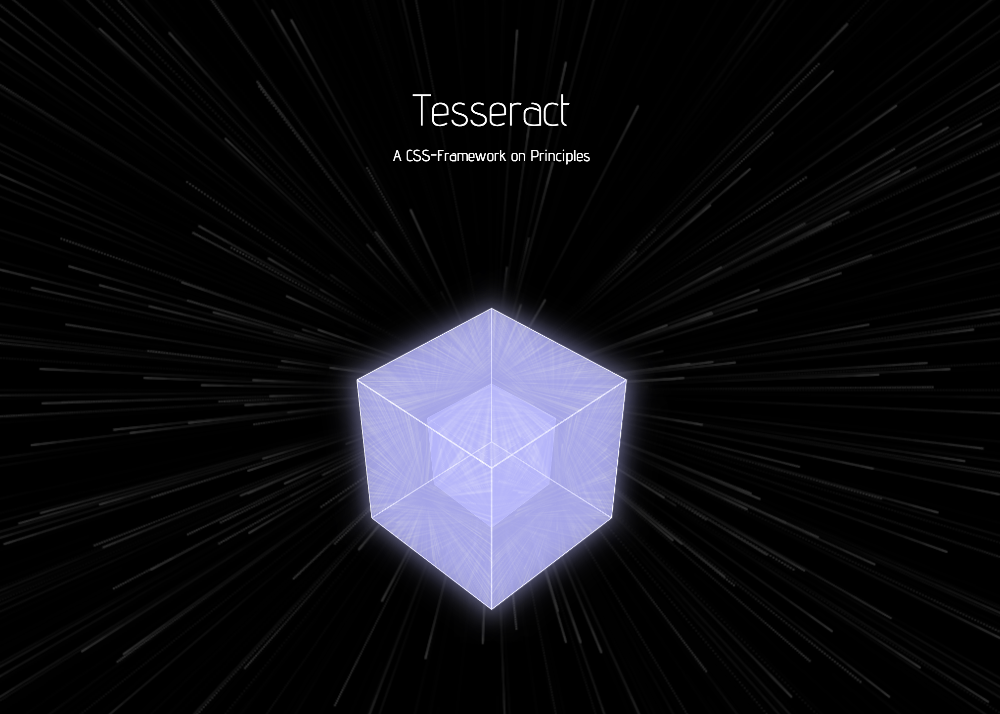

[](https://pape-io.github.io/tesseract/)
[Reference page](https://pape-io.github.io/tesseract/)

It’s a challenge in any web development project to structure and organize all the css code.

Existing css frameworks often disregard basic software principles. This makes the usage of them harder and your own software even harder to manage.

This css framework is build upon existing software principles to help keeping things simple and manageable.

## Quick start guide

## Create own components

## Principles

In software development, principles help you to make complex things managable.

### Single responsibility

A class should have responsibility over only a single part of your system.

**:thumbsup: Responsible for one thing**
```css
.padding-all-medium {
  padding: 15px;
}

.margin-bottom-large {
  margin-bottom: 20px;
}

.border-all {
  border: 1px solid transparent;
}

.border-radius-small {
  border-radius: 4px;
}
```

**:thumbsdown: Responsible for multiple things**
```css
.alert {
  padding: 15px;
  margin-bottom: 20px;
  border: 1px solid transparent;
  border-radius: 4px;
}
```

### Separation of concerns

Do not mix concerns by styling native html elements that you may want to use just for their semantic reason.

**:thumbsup: Concerns seperated**
```html
<h1 class="headline-large">Thats my Seo optimized title<h1/>
<h3 class="headline-large">Thats another realy big text, visually</h3>
```

```css
.headline-extra-large {
  @extend .font-size-large
  @extend .font-weight-bold
  @extend .margin-bottom-small
}
```

**:thumbsdown: Concerns not seperated**
```html
<h1>Thats my Seo optimized title</h1>
<h1>Text that should just look like a big headline</h1>
```

```css
h1 {
  font-size: 6em;
  font-weight: bold;
  margin-bottom: 16px;
}
```

### Conceptual integrity

Stick to a single, simple set of design principles and stay consistent

**:thumbsup: Consistent**
```css
.font-size-small {
  font-size: 100%;
}

.font-size-medium {
  font-size: 110%;
}

.font-size-large {
  font-size: 140%;
}
```

**:thumbsdown: Inconsistent**
```css
.font-size-small {
  font-size: 100%;
}

.font-size-medium {
  font-size: 4em;
}

.font-size-large {
  font-size: 100px;
}
```

### Economic

Prevent unnecessary complexity. Focus on what is really needed and limit yourself

**:thumbsup: Limited complexity**
```css
.font-size-small {
  font-size: 100%;
}

.font-size-medium {
  font-size: 110%;
}

.padding-left-large {
  font-size: 140%;
}
```

**:thumbsdown: Unfocused, useless complexity**
```css
.font-size-xxs {
  font-size: 70%;
}

.font-size-xs {
  font-size: 90%;
}

.font-size-s {
  font-size: 100%;
}

.font-size-m {
  font-size: 110%;
}

.font-size-l {
  font-size: 140%;
}

.font-size-xl {
  font-size: 160%;
}

.font-size-xxl {
  font-size: 200%;
}
```

### Visibility & symmetry

Using a consistent and comprehensible way of terminology makes classnames predictable and easy to use

**:thumbsup: Comprehensible, predictable**
```css
.font-size-small {
  font-size: 100%;
}

.margin-top-medium {
  margin-top: 5%;
}

.padding-bottom-large {
  padding-bottom: 10%;
}
```

**:thumbsdown: Incomprehensible**
```css
.fsS {
  font-size: 100%;
}

.mt-M {
  margin-top: 5%;
}

.pbL {
  padding-bottom: 10%;
}
```

### Self-organized

Create scaleable, efficent and economical systems with self-organized, decentralized components

**:thumbsup: Self-organized**
```css
.message { ... }

.message-image { ... }

.message-image-subtitle { ... }
```

**:thumbsdown: Dependent, not reusable**
```css
.message { ... }

.message .image { ... }

.message .image .subtitle { ... }
```

### Abstraction, Structuring, Hierarchising, Modularity

Abstract, structure, hierarchise repeating patterns to make them reusable/modular

**:thumbsup: Hierarchised, abstracted, modularized**
```css
.border-top {
  border-top: 1px solid grey;
}
.border-right {
  border-right: 1px solid grey;
}
.border-bottom {
  border-bottom: 1px solid grey;
}
.border-left {
  border-left: 1px solid grey;
}
.border-all {
  @extend .border-top;
  @extend .border-right;
  @extend .border-bottom;
  @extend .border-left;
}
```

**:thumbsdown: Repeated, redundant**
```css
.border-top {
  border-top: 1px solid grey;
}
.border-right {
  border-right: 1px solid grey;
}
.border-bottom {
  border-bottom: 1px solid grey;
}
.border-left {
  border-left: 1px solid grey;
}
.border-all {
  border-top: 1px solid grey;
  border-right: 1px solid grey;
  border-bottom: 1px solid grey;
  border-left: 1px solid grey;
}
```

## Modules
With modules, concerns are separated. It's a self-contained unit that in a bigger context can be reused to execute the same action/functionality over and over again.
Flexibility and reuseablity are the benefits of modules. 

## Components
A component, by definition, is a unit of composition. It the context of this css-framwork, a component is made up of multiple modules.

## CSS Reset vs. CSS Normalization
Tesseract uses [css-reset](https://github.com/shannonmoeller/reset-css) to remove all default browser css values for elements.
This follows the principle of seperation of concerns (see [principles](https://github.com/pape-io/tesseract#principles)).

## Development

Requires to have node.js, ruby and bundler installed.

### Intitial checkout

```
git clone git@github.com:pape-io/tesseract.git

cd tesseract

bundle install

npm install

bower install

grunt
```

### Regression testing

For every distribution created locally screenshots from every module and component are created.
Those screenshots are used to compare visual changes during releases and pull requests.

### Unused and redundant css

Because the amount of css rules has a big impact on the browsers rendering performance, Tesseract uses [uncss](https://github.com/giakki/uncss) for detecting unused and [csscss](https://github.com/zmoazeni/csscss) for detecting redundant css rules.

### Build processes

#### Serve

```
grunt
```
or alternatively `grunt serve`

Builds the framework in `/.tmp`, spawns a webserver, opens the reference page and provides livereload.

#### Dist

```
grunt dist
```

Builds the framework and a compressed version in `/dist` and opens the reference page. Afterwards it creates screenshots from the reference page (overview) and screenshots for each module/component. Those screenshots are used to compare/identify visiual changes (see (Regression Testing)[#regression-testing]).

### Custom Icons

Tesseract uses a custom icon font for the reference page generated with [FontCustom](https://github.com/FontCustom/fontcustom/).
To generate this icon font inside of this project use:

```
fontcustom compile icons/vectors --templates scss --no-hash
```

## Credits

### Author

[Sebastian Pape](https://github.com/pape-io) is web-developer at heart and software craftsman focusing on full-stack application development.
This project was started as part of his thesis in computer science.

### BrowserStack

[](https://www.browserstack.com/)
This project uses BrowserStack to test on various browsers in an easy and automated way.
Thanks to BrowserStack for supporting this project.